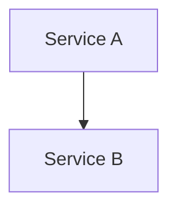

# diagrams-for-ai

[](https://github.com/tomascorrea/diagrams-for-ai/actions/workflows/ci.yml)
[](https://pypi.org/project/diagrams-for-ai/)

**AI-friendly architecture diagrams with grid-based positioning.**

diagrams-for-ai is a Python library that renders beautiful cloud architecture diagrams without Graphviz. Nodes are placed on a simple grid using `row` and `col` coordinates, making it trivial for an AI to generate diagrams programmatically.

## Why diagrams-for-ai?

- **Grid-based positioning** -- Place nodes with `row` and `col`. No fighting with Graphviz layout.
- **AI-friendly** -- Explicit coordinates are easy for language models to produce and reason about.
- **Real icons** -- Leverages the [diagrams](https://diagrams.mingrammer.com/) package for hundreds of icons across AWS, GCP, Azure, Kubernetes, and more.
- **Beautiful connections** -- Four line styles: curved (bezier), straight, orthogonal, and step.
- **SVG & PNG output** -- Portable SVG with embedded icons, or raster PNG via Pillow.
- **Familiar syntax** -- Use `>>`, `<<`, and `-` operators to connect nodes, just like the original `diagrams` library.
- **Hi-res rendering** -- Use `scale=2` (or higher) to uniformly multiply all pixel dimensions for sharp output on retina screens and in PDFs. Set `icon_size` per diagram for full control over icon proportions.
- **Mermaid import** -- Parse annotated Mermaid flowcharts (`.mmd` files) into diagrams. Grid positions and icons are embedded as Mermaid comments, so the same file renders in GitHub, IDEs, and diagrams-for-ai.

## Installation

```bash
uv add diagrams-for-ai
```

Or with pip:

```bash
pip install diagrams-for-ai
```

> The `diagrams` package (which provides the icons) is installed automatically as a dependency.

## Quick example

```python
from diagrams_for_ai import Diagram, Node

with Diagram("Hello", rows=2, cols=2, outformat="png", show=False):
    a = Node("Service A", icon="aws/compute/ec2", row=0, col=0)
    b = Node("Service B", icon="aws/database/rds", row=1, col=1)
    a >> b
```

## Full example

```python
from diagrams_for_ai import Cluster, Diagram, Edge, LineStyle, Node

with Diagram("AWS Web Service", rows=5, cols=7, outformat=["svg", "png"], show=False):

    with Cluster("Public Subnet", row=0, col=1, width=5, height=2,
                 bg_color="#FFF3E0", border_color="#FFB74D"):
        users = Node("Users", icon="aws/general/users", row=0, col=3)
        cdn = Node("CloudFront", icon="aws/network/cloudfront", row=1, col=3)

    with Cluster("Private Subnet", row=2, col=0, width=7, height=3,
                 bg_color="#E8F5E9", border_color="#81C784"):
        lb = Node("ALB", icon="aws/network/elastic-load-balancing", row=2, col=3)
        web1 = Node("Web 1", icon="aws/compute/ec2", row=3, col=1)
        web2 = Node("Web 2", icon="aws/compute/ec2", row=3, col=5)
        db = Node("Aurora", icon="aws/database/aurora", row=4, col=3)

    users >> cdn >> lb
    lb >> [web1, web2]
    web1 >> db
    web2 >> Edge(style="dashed", line_style=LineStyle.ORTHO) >> db
```

## Features

### Connection styles

| Style | Usage | Description |
|-------|-------|-------------|
| Curved | `a >> b` | Smooth bezier curves (default) |
| Straight | `a >> Edge(line_style=LineStyle.STRAIGHT) >> b` | Direct lines |
| Orthogonal | `a >> Edge(line_style=LineStyle.ORTHO) >> b` | Right-angle routing |
| Step | `a >> Edge(line_style=LineStyle.STEP) >> b` | Horizontal-then-vertical |

### Edge customization

```python
a >> Edge(label="HTTPS", color="#2ECC71", style="dashed") >> b
```

### Clusters

```python
with Cluster("VPC", row=0, col=0, width=4, height=3,
             bg_color="#E8F4FD", border_color="#B0C4DE"):
    # nodes inside the cluster
    ...
```

### Mermaid import

Write your architecture in Mermaid with position annotations in comments:



Then render it with diagrams-for-ai:

```python
from diagrams_for_ai import Diagram

d = Diagram.from_mermaid_file("architecture.mmd", show=False)
d.render()
```

See [Mermaid Import docs](docs/mermaid-import.md) for the full annotation syntax.

### Hi-res rendering

Use `scale` for sharper output in PDFs, print, or retina displays:

```python
with Diagram("Hi-Res", rows=2, cols=2, scale=2, outformat="png", show=False):
    a = Node("Service A", icon="aws/compute/ec2", row=0, col=0)
    b = Node("Service B", icon="aws/database/rds", row=1, col=1)
    a >> b
```

Or in Mermaid:

```
%% @config name="Hi-Res" rows=2 cols=2 scale=2
```

Set `icon_size` to control the base icon size per diagram (default 64px):

```python
with Diagram("Large Icons", rows=2, cols=2, icon_size=80, outformat="png", show=False):
    ...
```

### Icon providers

AWS, GCP, Azure, Kubernetes, on-premises, and [13 more providers](https://diagrams.mingrammer.com/docs/nodes/aws) -- all from the `diagrams` package.

```python
Node("Server", icon="aws/compute/ec2", row=0, col=0)
Node("Pod", icon="k8s/compute/pod", row=0, col=1)
Node("Postgres", icon="onprem/database/postgresql", row=0, col=2)
```

## Development

```bash
# Install dependencies
uv sync

# Run tests
uv run pytest

# Serve docs locally
uv run mkdocs serve
```

## License

MIT -- see [LICENSE](LICENSE) for details.
